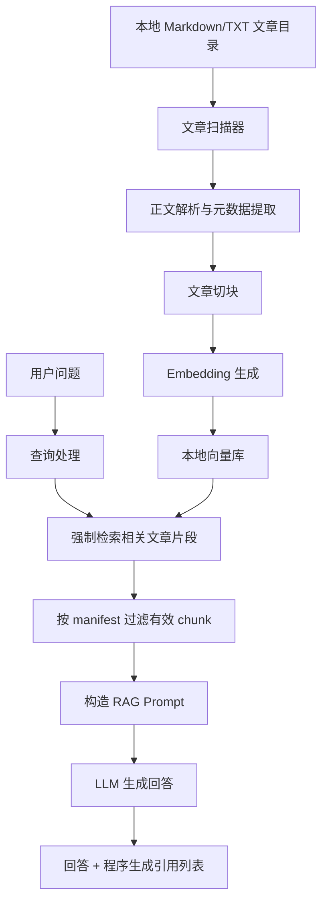

# 猫笔刀文章 RAG Agent 需求与任务拆分

> 本文档是 MVP 阶段的历史规划基线，用于回看第一版目标、技术路线和任务拆分。后续新的需求改动不再直接追加到本文档，应按 [改动需求文档沉淀流程](change-documentation-workflow.md) 新建 OpenSpec change，并在完成后同步 `docs/progress.md` 和必要专题文档。

## 1. 项目目标

做一个面向个人使用的"猫笔刀文章 Agent"。用户每次与 Agent 对话时，系统都必须先从本地猫笔刀文章库中检索相关文章，再结合检索结果回答。

第一版目标不是做一个复杂平台，而是先做一个可运行、可验证、可持续补充文章的本地 RAG Agent。

核心成功标准：

- 能从本地目录递归读取 `.md` / `.txt` 文章。
- 能把文章清洗、切块、向量化并写入本地向量库。
- 用户每次提问时，服务端代码强制先检索文章，而不是只靠提示词要求模型检索。
- Agent 回复必须基于检索到的文章片段，并标注引用来源。
- 如果没有检索到足够依据，Agent 要明确说明"猫笔刀文章库中没有找到足够依据"，不能把模型常识伪装成文章观点。

## 2. 当前已确认信息

| 项 | 当前结论 |
|---|---|
| 文章来源 | 本地目录 |
| 文件格式 | Markdown / TXT |
| 文章目录路径 | 暂时留空，后续填写 |
| 使用方式 | 与 Agent 对话，每次都结合文章做 RAG |
| 第一版目标 | 本地可运行 MVP |

第一版建议配置：

```env
ARTICLE_SOURCE_DIR=
DATA_DIR=data

OPENAI_COMPAT_BASE_URL=
OPENAI_COMPAT_API_KEY=
EMBEDDING_MODEL=
LLM_MODEL=

TOP_K=8
SIMILARITY_THRESHOLD=0.5
RAG_CONTEXT_TOKEN_BUDGET=6000
LOG_LEVEL=INFO
```

说明：

- `DATA_DIR` 是数据根目录，Chroma 持久化目录为 `{DATA_DIR}/chroma`，manifest 路径为 `{DATA_DIR}/index_manifest.json`，整个 `data/` 目录已在 `.gitignore` 中忽略。
- Embedding 和 LLM 默认共用 `OPENAI_COMPAT_BASE_URL` 和 `OPENAI_COMPAT_API_KEY`；如果需要不同服务，支持 `EMBEDDING_BASE_URL`、`EMBEDDING_API_KEY`、`LLM_BASE_URL`、`LLM_API_KEY` 覆盖默认值，但这些不在 MVP 主配置样例中。
- Token 估算统一使用字符估算：`estimated_tokens = ceil(chars / 1.5)`，适用于中文内容；后续引入精确 tokenizer 后替换。
- `RAG_CONTEXT_TOKEN_BUDGET` 作为检索片段 token 预算固定上限，按相似度从高到低塞入 chunk，超过预算即停止；MVP 不做动态 token 预算计算。
- `SIMILARITY_THRESHOLD` 使用 retriever 统一换算后的 0-1 相似度分数，不直接暴露 Chroma 原始 distance。MVP 固定使用 cosine distance，换算为 `similarity = clamp(1 - cosine_distance, 0, 1)`，初始阈值 0.5 需要用真实文章评测后调整。
- 敏感值只能写入本机 `.env`，不能提交到仓库；`.env.example` 只列核心配置和可选覆盖项，代码默认值不放进 `.env.example`，只在下方配置表和 README 中说明。
- Python 版本要求写入 `pyproject.toml` 的 `requires-python = ">=3.10"`，README 也同步说明。
- 不同命令需要不同配置：`ingest` / `search` 需要 `ARTICLE_SOURCE_DIR` + embedding 配置；`chat` 额外需要 LLM 配置。缺少所需配置时按命令报清晰错误。

以下配置项作为代码默认值，不在 `.env` 中暴露：

| 配置项 | 默认值 | 说明 |
|---|---|---|
| `VECTOR_STORE` | `chroma` | MVP 固定 |
| `VECTOR_DISTANCE_METRIC` | `cosine` | MVP 固定 |
| `EMBEDDING_MAX_TOKENS` | `8191` | 对应 text-embedding-ada-002，更换模型时需同步调整 |
| `EMBEDDING_BATCH_SIZE` | `32` | |
| `EMBEDDING_REQUESTS_PER_MINUTE` | `60` | |
| `CHUNK_TARGET_MIN_CHARS` | `600` | |
| `CHUNK_TARGET_MAX_CHARS` | `1000` | |
| `CHUNK_OVERLAP` | `100` | 中文字符 |
| `MAX_OUTPUT_TOKENS` | `2048` | LLM 最大输出 token 数 |
| `CHAT_HISTORY_TURNS` | `4` | 1 轮 = 1 次用户提问 + 1 次助手回答 |
| `LLM_CONTEXT_WINDOW` | `32768` | 模型上下文窗口上限 |

## 3. 范围边界

第一版要做：

- 本地文章导入。
- Markdown / TXT 正文解析。
- 文章元数据提取。
- 文章分块。
- Embedding 生成。
- 本地向量库持久化。
- 文章新增、修改、删除后的索引同步。
- 基础检索。
- 强制 RAG 对话流程。
- 回复引用来源。
- 基础命令行交互。

第一版暂不做：

- 自动抓取公众号文章。
- 绕过登录或反爬的数据采集。
- 多用户账号系统。
- Web 管理后台。
- 复杂权限管理。
- 长期任务调度平台。
- 精细化文章标签体系。

这些可以放到第二阶段。

## 4. 推荐技术路线

### 4.1 MVP 技术选型

推荐第一版使用 Python 实现。

原因：

- RAG 生态成熟。
- 本地文件处理方便。
- 向量库、embedding、LLM 调用都容易集成。
- 后续可以平滑升级成 API 服务或 Web 应用。

建议选型：

| 模块 | 推荐 | 说明 |
|---|---|---|
| 语言 | Python 3.10+ | 适合快速做 RAG 原型和本地工具，兼容 Chroma、pydantic-settings 等依赖 |
| 配置 | `.env` + `pydantic-settings` | 避免把路径、API key 写死 |
| 原始文章 | 本地 Markdown / TXT | 后续你补 `ARTICLE_SOURCE_DIR` |
| 向量库 | Chroma | 已确认第一版使用，本地持久化方便 |
| Embedding | OpenAI-compatible API | 已确认第一版使用兼容 OpenAI Embeddings 协议的模型服务 |
| LLM | OpenAI-compatible API | 使用兼容 OpenAI Chat Completions 协议的模型服务 |
| CLI | `typer` | 轻量 CLI 框架 |
| HTTP | `openai` SDK | 同时用于 embedding 和 chat，兼容 OpenAI 协议 |
| 测试 | `pytest` | fake embedding client + fixture 文章，离线测试 |

Embedding 和 LLM 默认共用 `OPENAI_COMPAT_BASE_URL` 和 `OPENAI_COMPAT_API_KEY`，也可以分别配置不同的 `base_url`、`api_key` 和模型名。

Embedding 生成需要注意三个运行时限制：

- chunk 文本必须小于 `EMBEDDING_MAX_TOKENS`（默认 8191）。MVP 用字符估算判断超限，超限时继续拆分。
- 批量索引时按 `EMBEDDING_BATCH_SIZE`（默认 32）分批请求，避免一篇篇调用导致速度过慢。
- 如果服务商有速率限制，按 `EMBEDDING_REQUESTS_PER_MINUTE`（默认 60）做简单限流，并对 429/5xx 做指数退避重试。

LLM 统一走 OpenAI-compatible 适配层，这样第一版代码只需要实现一套 Chat Completions 调用逻辑，后续可以通过配置切换不同兼容服务。

### 4.2 后续可升级方向

如果第一版稳定，再考虑：

- 从 Chroma 迁移到 Qdrant 或 Postgres + pgvector。
- 增加 BM25 + 向量检索的混合检索。
- 增加 rerank，提高引用片段质量。
- 增加 Web UI。
- 增加定时索引、索引审计报告和更完整的异常恢复。
- 增加评测集，持续检查回答质量。
- 引入精确 tokenizer 替换字符估算。

## 5. 系统架构



核心约束：`用户问题 -> 检索 -> manifest 过滤 -> 构造上下文 -> 回答` 这条链路必须在代码中固定，不能让模型自行决定是否检索。引用列表由程序根据检索结果生成，不交给 LLM 编造。

## 6. 数据设计

### 6.1 Article 元数据

每篇文章保存这些信息：

| 字段 | 说明 |
|---|---|
| `article_id` | 文章唯一 ID，由 `ARTICLE_SOURCE_DIR` 下的相对路径 hash 生成；文件移动或重命名会被视为新文章，旧路径按删除文件处理 |
| `title` | 标题，优先从 Markdown frontmatter 的 `title` 提取，其次从一级标题提取，最后使用文件名 |
| `source_path` | 本地文件绝对路径（内部使用） |
| `source_rel_path` | 相对于 `ARTICLE_SOURCE_DIR` 的路径（展示给用户） |
| `file_type` | `md` 或 `txt` |
| `content_hash` | 原始文件字节 sha256，用于判断是否需要重新索引 |
| `modified_time` | 文件最后修改时间 |
| `created_at` | 首次入库时间 |
| `updated_at` | 最近索引时间 |

### 6.2 索引状态持久化

第一版使用一个本地 manifest 文件保存文章级索引状态，默认路径为 `{DATA_DIR}/index_manifest.json`。

建议结构：

```json
{
  "schema_version": 1,
  "source_root": "/path/to/article-root",
  "vector_store": "chroma",
  "vector_distance_metric": "cosine",
  "embedding_provider": "openai-compatible",
  "embedding_model": "your-embedding-model",
  "embedding_dimension": 1536,
  "chunker_config": {
    "target_min_chars": 600,
    "target_max_chars": 1000,
    "overlap_chars": 100
  },
  "articles": {
    "<article_id>": {
      "title": "文章标题",
      "source_path": "/path/to/article.md",
      "source_rel_path": "subdir/article.md",
      "file_type": "md",
      "content_hash": "sha256:...",
      "chunk_ids": ["<chunk_id>"],
      "created_at": "2026-05-08T10:00:00+08:00",
      "modified_time": "2026-05-08T10:00:00+08:00",
      "updated_at": "2026-05-08T10:05:00+08:00"
    }
  }
}
```

实现约束：

- `content_hash` 定义为原始文件字节的 sha256，用于判断文件是否需要重新索引。使用原始字节而非清洗后正文，确保 frontmatter 或标题的改动也不会被漏掉。`chunk_id = sha256(article_id + content_hash + chunk_index)` 也使用该 hash。
- Chroma 的 chunk metadata 中也保存 `content_hash`、`embedding_model` 和 `embedding_dimension`，用于排查问题和发现向量库状态不一致。
- Chroma chunk 正文作为 document 存储，metadata 只保存结构化字段，避免把大段正文重复塞进 metadata。
- manifest 写入要使用临时文件 + 原子替换，避免索引中断导致 JSON 文件写坏。
- 索引按文章粒度处理：同一篇文章重新索引时，先生成新 chunk 和 embedding 并写入 Chroma，写入成功后再更新 manifest 并删除旧 `chunk_ids`；删除旧 chunk 失败只记录 warning，不阻断流程。
- **MVP 不做复杂一致性自愈**：如果 ingest 启动时发现 manifest 与 Chroma 状态不一致（孤儿 chunks、manifest 指向但 Chroma 缺失的 chunks），直接提示用户执行 `mooomoocatrag ingest --rebuild`，不自动修复。
- 如果 `EMBEDDING_MODEL` 或 embedding 维度与 manifest / Chroma 元数据不一致，程序必须停止并提示用户执行 `mooomoocatrag ingest --rebuild`，不能混用新旧向量。
- 启动 `ingest`、`search`、`chat` 时还需比较 `source_root`、`vector_store`、`vector_distance_metric`、`chunker_config` 与当前配置是否一致；不一致就提示 `ingest --rebuild`。
- `embedding_dimension` 在首次建库时由首批 embedding 的向量长度自动写入 manifest，不需要用户配置。

### 6.3 Chunk 元数据

每个文章片段保存这些信息：

| 字段 | 说明 |
|---|---|
| `chunk_id` | 片段唯一 ID，`sha256(article_id + content_hash + chunk_index)` |
| `article_id` | 所属文章 |
| `chunk_index` | 片段序号 |
| `nearest_heading` | 所属最近任意级 Markdown 标题，无标题则为空 |
| `text` | 片段正文，作为 Chroma document 存储，不作为 metadata 字段重复保存 |
| `source_rel_path` | 相对于 `ARTICLE_SOURCE_DIR` 的路径（展示给用户） |
| `title` | 文章标题 |
| `content_hash` | 所属文章当前原始文件字节 sha256 |
| `embedding_model` | 生成该 chunk 向量时使用的 embedding 模型 |
| `embedding_dimension` | 生成该 chunk 向量时的维度 |

## 7. 文章导入与切块策略

### 7.1 文件扫描

扫描规则：

- 从 `ARTICLE_SOURCE_DIR` 递归扫描。
- 只处理 `.md`、`.txt` 文件。
- 默认文件编码 UTF-8，读取失败时报清晰错误。
- 跳过隐藏目录，例如 `.git`、`.obsidian`、`.trash`。
- 对每个文件计算原始字节 sha256 作为 `content_hash`。
- 将当前 hash 与 manifest 中记录的 `content_hash` 对比；如果 hash 没变化，则跳过重新索引。
- 如果 manifest 中存在但当前扫描不到源文件，从 Chroma 删除该文章的 `chunk_ids`，并从 manifest 移除文章记录。删除失败时记录 warning 并继续处理其他文件，不中断整个 ingest；retriever 查询时按 manifest 过滤有效 chunk，避免检索到残留数据。

### 7.2 标题提取

标题优先级：

1. Markdown frontmatter 中的 `title`（MVP 只支持 `---` 包裹的 YAML frontmatter）。
2. Markdown 第一个 `# 一级标题`。
3. 文件名去后缀。

TXT 文件默认使用文件名作为标题。

### 7.3 正文清洗

基础清洗：

- 去掉 Markdown frontmatter。
- 保留标题层级。
- 保留正文段落。
- 去掉过多空行。
- 暂不删除文章里的观点性表达，避免破坏原文语义。

### 7.4 切块规则

第一版使用"标题感知 + 段落切分"：

- 优先按 Markdown 标题结构分段。
- 每个 chunk 目标长度由 `CHUNK_TARGET_MIN_CHARS=600` 和 `CHUNK_TARGET_MAX_CHARS=1000` 控制。
- 相邻 chunk 默认保留 `CHUNK_OVERLAP=100` 个中文字符。
- 每个 chunk 保留 `title`、`nearest_heading`、`source_rel_path`、`chunk_index` 作为元数据。
- `nearest_heading` 定义为 chunk 所属的最近任意级 Markdown 标题文本，不保存完整 heading_path；无标题则为空。
- 如果某个标题段不足 `CHUNK_TARGET_MIN_CHARS`，且与下一个标题段合并后不超过 `CHUNK_TARGET_MAX_CHARS`，则合并为一个 chunk，`nearest_heading` 取第一个 section 的标题；否则保留为独立短 chunk。
- overlap 不跨标题边界：如果相邻两个 section 各自独立成 chunk，overlap 只在同一个 section 内的段落切分时使用。
- 如果 chunk 按字符长度切分后估算 token 数仍超过 `EMBEDDING_MAX_TOKENS`，必须继续拆分，不能依赖 embedding 服务端静默截断。

### 7.5 Embedding 模型更换

向量只对生成它的 embedding 模型有效。更换 `EMBEDDING_MODEL` 后可能出现维度不同、相似度分布变化或检索失败。

第一版处理方式：

- manifest 和 Chroma metadata 都记录 `embedding_model` 与 `embedding_dimension`。
- 启动 `ingest`、`search`、`chat` 时检查当前配置是否与已有索引一致。
- 如果不一致，直接报错并提示重建：`mooomoocatrag ingest --rebuild`，或手动删除 `{DATA_DIR}/chroma` 与 `{DATA_DIR}/index_manifest.json` 后重新索引。

## 8. 检索与回答策略

### 8.1 检索流程

每次用户提问：

1. 接收用户问题。
2. 使用原始问题直接检索（MVP 不做 query rewrite，第二阶段再引入）。
3. 使用 embedding 检索 top-k chunk。
4. 使用 `SIMILARITY_THRESHOLD` 过滤相似度过低的结果。
5. 按 manifest 过滤有效 chunk（确保只返回 manifest 中存在的文章和 content_hash 匹配的 chunk）。
6. 按 `RAG_CONTEXT_TOKEN_BUDGET` 固定上限，按相似度从高到低塞入 chunk，超过预算即停止。
7. 构造上下文。
8. 调用 LLM 回答。
9. 输出答案和程序生成的引用列表。

MVP 检索实现约束：

- Chroma collection 固定使用 `VECTOR_DISTANCE_METRIC=cosine`，collection 名称固定为 `mooomoocat_articles`，创建 collection 时写入 metadata：`hnsw:space=cosine`、`schema_version`、`embedding_model`、`embedding_dimension`。
- `TOP_K` 是最终返回数量；底层 Chroma 查询 overfetch 为 `max(TOP_K * 3, TOP_K + 10)`，经过阈值过滤和 manifest 过滤后再截断到 `TOP_K`。
- retriever 不向上层暴露 Chroma 原始 distance，只返回统一后的 `similarity`。
- cosine distance 统一换算为 `similarity = clamp(1 - cosine_distance, 0, 1)`。
- `SIMILARITY_THRESHOLD=0.5` 只是 MVP 初始值，必须通过阶段 4 的手工评测问题调整。

### 8.2 回答规则

Agent 的回答必须遵守：

- 优先基于检索到的猫笔刀文章片段回答。
- LLM 回答中使用 `[1]`、`[2]` 等短引用标记。
- 引用列表由程序根据检索结果生成，不交给 LLM 编造。
- 如果多个片段观点不同，要说明差异。
- 如果文章库没有足够证据，要明确说没有足够依据。
- 可以做推断，但必须标明"这是基于检索内容的推断"。

### 8.3 引用格式

正文中的引用标记由 LLM 生成（如 `[1]`），引用列表由程序拼出。进入 prompt 的 chunk 由程序预编号 `[1..N]`，引用列表按同一顺序生成。MVP 输出所有进入上下文的 chunk 引用，不解析 LLM 实际使用了哪些编号。格式示例：

```text
[1] 文章标题 | subpath/article.md | chunk 3 | 小标题：xxx
[2] 另一篇文章 | another.md | chunk 1
```

引用中只使用相对于 `ARTICLE_SOURCE_DIR` 的路径，不暴露本机绝对路径。

### 8.4 Prompt 约束草案

```text
你是一个基于猫笔刀文章库回答问题的 Agent。
你必须优先依据给定的文章片段回答。
使用 [1]、[2] 等标记引用对应片段。
不要把没有出现在文章片段中的内容说成猫笔刀文章观点。
如果文章片段不足以回答，直接说明"当前猫笔刀文章库中没有找到足够依据"。
```

### 8.5 上下文窗口管理

MVP 使用简化策略：

1. `RAG_CONTEXT_TOKEN_BUDGET` 作为检索片段总 token 数固定上限。
2. 检索结果按相似度从高到低放入上下文，估算 token 数超过预算时停止追加。
3. Token 估算统一使用字符估算：`estimated_tokens = ceil(chars / 1.5)`。
4. 如果过滤和预算控制后没有可用 chunk，直接进入"没有足够依据"的回答策略。
5. 定义 `input_token_budget = LLM_CONTEXT_WINDOW - MAX_OUTPUT_TOKENS`，所有 system prompt、检索片段、用户问题、对话历史的估算 token 总和不能超过 `input_token_budget`。超限时优先裁剪对话历史，再减少低相似度 chunk。

### 8.6 对话历史管理

`mooomoocatrag chat` 是连续对话，但第一版不做长期记忆，只保留当前 CLI 会话内的短历史。

规则：

- 最多保留最近 `CHAT_HISTORY_TURNS=4` 轮用户/助手消息。
- 每次回答仍然必须重新执行检索，不能只依赖历史消息。
- MVP 检索 query 固定使用当前用户问题，不做 query rewrite；如果当前问题依赖上文导致检索不足，先返回"没有足够依据"，第二阶段再引入历史压缩或 query rewrite。
- prompt 预算优先级为：system 规则、当前用户问题、检索片段、最近对话历史。预算不足时先裁剪历史，再减少低相似度 chunk。
- 历史消息不能覆盖"没有足够依据"的规则；文章库没有证据时必须明说。

## 9. 建议项目结构

```text
mooomoocat-article-rag-agent/
  README.md
  .env.example
  pyproject.toml
  docs/
    mooomoocat-article-rag-agent-plan.md
  src/
    mooomoocatrag/
      __init__.py
      config.py
      cli.py
      ingest/
        scanner.py
        parser.py
        chunker.py
        indexer.py
      rag/
        embeddings.py
        vector_store.py
        retriever.py
        prompt.py
        chat.py
      models.py
  tests/
    conftest.py
    fixtures/
      sample.md
      sample.txt
    test_parser.py
    test_chunker.py
    test_embeddings.py
    test_vector_store.py
    test_retriever.py
    test_prompt.py
    test_chat.py
```

说明：

- `tests/conftest.py` 提供 fake embedding client 和通用 fixture。
- `tests/fixtures/` 放几篇样例文章，保证 parser/chunker/manifest/retriever 的测试可以离线跑。

## 10. 命令设计

第一版提供这些命令：

```bash
# 导入和索引文章（首次运行时自动创建所需目录和初始 manifest）
mooomoocatrag ingest

# 清空旧索引并重建，常用于更换 embedding 模型后
mooomoocatrag ingest --rebuild

# 跳过确认直接重建（适用于脚本化场景）
mooomoocatrag ingest --rebuild --force

# 测试检索
mooomoocatrag search "某个问题"

# 进入对话（输入 /exit、/quit 或 Ctrl-D 退出）
mooomoocatrag chat
```

`mooomoocatrag search` 的输出格式：

```text
---
[1] 相似度: 0.85 | 文章标题 | subpath/article.md | chunk 3 | 小标题：xxx
  片段正文前 200 字...

[2] 相似度: 0.72 | 另一篇文章 | another.md | chunk 1
  片段正文前 200 字...
---
共 2 个结果
```

`mooomoocatrag chat` 的退出方式：

- 输入 `/exit` 或 `/quit` 退出。
- Ctrl-D 退出。
- 退出时打印会话统计（提问次数、引用的文章数）。

`mooomoocatrag ingest` 的初始化行为：

- 如果 `.env` 不存在或缺少所需配置，按命令报清晰的配置错误并提示补全 `.env`：`ingest`/`search` 需要 `ARTICLE_SOURCE_DIR` + embedding 配置；`chat` 额外需要 LLM 配置。
- 自动创建 `{DATA_DIR}/chroma` 目录和 `{DATA_DIR}/index_manifest.json` 的父目录。
- 如果 manifest 不存在，则创建带 `schema_version`、模型信息和空 `articles` 的初始 manifest，不能只写 `{}`。
- `.env.example` 作为仓库文件提交，只列核心配置和可选覆盖项，代码默认值不放进 `.env.example`。

`mooomoocatrag ingest --rebuild` 的行为：

- 默认在终端提示用户输入 `y` 确认后再执行清空和重建。
- 加 `--force` 可跳过确认，适用于脚本化场景。
- 清空 `{DATA_DIR}/chroma` 中的向量数据和 `{DATA_DIR}/index_manifest.json`，然后重新执行完整索引流程。

`mooomoocatrag ingest` 的删除同步行为：

- 每次扫描后，将当前文件集合与 manifest 中的 `source_path` 对比。
- 对已经不存在的源文件，删除 Chroma 中对应 `chunk_ids`，再从 manifest 移除文章记录。
- 删除同步失败时记录 warning 并继续处理其他文件，不中断整个 ingest；在最终摘要中报告失败数。
- retriever 查询时按 manifest 过滤有效 chunk，确保残留数据不会被返回。

`mooomoocatrag ingest` 完成后输出摘要：

```text
索引完成：扫描 42 个文件，跳过 38（未变化），新增 2，更新 1，删除 1，共 15 个 chunks，1 个警告
```

## 11. 任务拆分

### 阶段 1：项目脚手架与配置

| 任务 | 预计耗时 | 依赖 | 完成标准 |
|---|---:|---|---|
| 创建 Python 项目结构 | 2h | 无 | `src/mooomoocatrag`、`tests`、`docs` 目录齐全 |
| 配置依赖管理 | 2h | 项目结构 | `pyproject.toml` 可安装依赖 |
| 增加配置加载 | 3h | 项目结构 | 能从 `.env` 读取核心配置，代码默认值覆盖非核心配置 |
| 增加 `.env.example` | 1h | 配置项确认 | 只列核心配置和可选覆盖项，敏感值只放空值或说明性占位符 |
| 增加 CLI 入口 | 2h | 配置加载 | 可以运行 `mooomoocatrag --help` |
| 增加日志基础设施 | 1h | 配置加载 | 支持 `LOG_LEVEL`，日志中不打印 API key |

### 阶段 2：文章读取、解析和切块

| 任务 | 预计耗时 | 依赖 | 完成标准 |
|---|---:|---|---|
| 实现文件扫描器 | 3h | 配置加载 | 能递归找到 `.md` / `.txt` 文件 |
| 实现 Markdown 解析 | 3h | 文件扫描器 | 能提取标题、正文、frontmatter |
| 实现 TXT 解析 | 1h | 文件扫描器 | 能读取正文并用文件名作为标题 |
| 实现内容 hash | 1h | 文件扫描器 | 能计算原始文件字节 sha256 |
| 实现索引 manifest | 2h | 内容 hash | 能持久化 `schema_version`、`source_root`、`content_hash`、chunk IDs、chunker 配置、embedding 模型，原子写入 |
| 实现 chunker | 5h | 解析器 | 能按标题/段落切块并保留元数据（nearest_heading、chunk_index） |
| 单元测试 scanner/parser/chunker/manifest | 4h | scanner/parser/chunker/manifest | 覆盖标题提取、空文件、长文章、中文段落、hash 未变化跳过；使用 fixture 文章和 fake embedding，不依赖真实 API；Chroma 删除同步测试移到阶段 3 |

### 阶段 3：向量化和索引

| 任务 | 预计耗时 | 依赖 | 完成标准 |
|---|---:|---|---|
| 封装 embedding 接口 | 3h | 配置加载 | 支持 OpenAI-compatible Embeddings API，可配置 base URL、API key、model |
| 实现 embedding 批处理和限流 | 3h | embedding 接口 | 支持 batch、RPM 限流、429/5xx 重试 |
| 接入本地向量库 | 3h | 配置加载 | 能持久化 chunk 向量和元数据，可先用假向量测试 |
| 实现 ingest 命令 | 5h | scanner/parser/chunker/vector store | `mooomoocatrag ingest` 能完成扫描、切块、入库、删除同步和摘要输出 |
| 实现增量索引 | 3h | ingest 命令 | 未变化文件不会重复向量化 |
| 实现 embedding 模型一致性检查 | 2h | manifest + vector store | 模型或维度不一致时提示重建索引 |
| 单元测试 embedding/vector store/indexer | 4h | embedding/vector store/indexer | 覆盖 batch、限流重试、模型不一致、增量跳过、Chroma 删除同步、配置不一致检测；使用 fake embedding client，不依赖真实 API |

### 阶段 4：检索能力

| 任务 | 预计耗时 | 依赖 | 完成标准 |
|---|---:|---|---|
| 实现 retriever | 3h | 向量库 | 输入问题能返回 top-k chunk |
| 实现相似度阈值过滤 | 2h | retriever | 固定 cosine distance，统一换算 0-1 similarity 后按 `SIMILARITY_THRESHOLD` 过滤 |
| 实现 manifest 有效 chunk 过滤 | 2h | retriever + manifest | 按 manifest 中的 article_id 和 content_hash 过滤，确保残留数据不会被返回 |
| 实现 search 命令 | 2h | retriever | `mooomoocatrag search` 能输出片段和来源 |
| 构造手工评测问题 | 2h | search 命令 | 至少 10 个问题能人工检查召回质量 |
| 调整 chunk 参数 | 2h | 评测问题 | top-k 结果更贴近问题 |
| 单元测试 retriever/search | 3h | retriever/search | 覆盖阈值过滤、无结果、引用来源、manifest 过滤 |

### 阶段 5：Agent 对话

| 任务 | 预计耗时 | 依赖 | 完成标准 |
|---|---:|---|---|
| 实现 RAG prompt 构造 | 2h | retriever | prompt 中包含检索片段和引用编号，引用列表由程序生成 |
| 实现 LLM 调用封装 | 3h | 配置加载 | 支持 OpenAI-compatible Chat Completions API，可配置 base URL、API key、model |
| 实现强制检索 chat 流程 | 4h | prompt + retriever + LLM | 每次问题都先执行 retriever |
| 实现对话历史管理 | 2h | chat 流程 | 只保留最近 `CHAT_HISTORY_TURNS` 轮，MVP 不做 query rewrite |
| 实现引用输出 | 2h | chat 流程 | 程序根据检索结果生成引用列表，不暴露绝对路径 |
| 实现无依据回答策略 | 2h | chat 流程 | 无足够检索结果时明确说明无法依据文章回答 |
| 实现 chat 命令 | 2h | chat 流程 | 可以进入命令行连续对话 |
| 单元测试 prompt/chat | 4h | prompt/chat | 覆盖强制检索、历史裁剪、无依据回答、引用列表生成 |

### 阶段 6：测试、评估和验收

| 任务 | 预计耗时 | 依赖 | 完成标准 |
|---|---:|---|---|
| 增加端到端测试样例 | 4h | 完整 MVP | 用 fixture 文章验证 ingest/search/chat；不依赖真实 API |
| 增加错误处理 | 3h | 完整 MVP | 路径为空、目录不存在、无文章、API key 缺失都有清晰报错 |
| 增加 README | 3h | 完整 MVP | 用户能按文档配置路径并运行 |
| 做一次真实文章验收 | 3h | 用户提供文章路径 | 用真实猫笔刀文章跑通问答 |
| 整理下一阶段优化项 | 1h | 验收完成 | 明确是否需要 Web UI、混合检索、rerank |

## 12. 依赖关系

```text
项目脚手架
  -> 配置加载
  -> 文件扫描
  -> 文章解析
  -> 文章切块
  -> 向量库索引
  -> retriever
  -> RAG prompt
  -> chat Agent
  -> 端到端验收
```

最关键路径是：

```text
配置 -> ingest -> vector store -> retriever -> chat
```

只要这条路径打通，就能形成第一版可用系统。

可以并行推进的工作：

- 文件扫描完成后，正文解析 / chunker 与 `content_hash` + manifest 持久化可以并行开发。
- embedding API 封装和 Chroma vector store 适配可以并行开发；vector store 可以先用假向量完成写入、查询和元数据测试。
- retriever 合同稳定后，`search` 命令和 LLM client / prompt 构造可以并行。
- 阶段 3-5 的测试应随功能一起补，不等到阶段 6 统一补。

## 13. 风险与处理

| 风险 | 影响 | 概率 | 处理方式 |
|---|---|---|---|
| 文章格式不统一 | 影响标题、正文和分块质量 | 中 | 解析器保持宽松，无法提取标题时使用文件名 |
| chunk 太碎或太长 | 影响召回和回答质量 | 高 | 保留评测问题，基于结果调整 chunk 大小 |
| 只做向量检索召回不足 | 有些关键词问题找不到文章 | 中 | 第二阶段加入 BM25 + 向量混合检索 |
| 模型脱离文章自由发挥 | 回答不可信 | 高 | 代码层面强制检索，prompt 中要求无法依据时直说；引用列表由程序生成 |
| OpenAI-compatible API 配置不完整 | 无法生成 embedding 或调用 chat 模型 | 中 | `.env.example` 写清楚配置，缺变量时报清晰错误 |
| 文章目录后续变更 | 索引过期 | 中 | 通过 hash 做增量索引，并在 MVP 中同步删除已不存在文件的 chunks |
| API key 泄露 | 账号或额度被盗用 | 中 | `.env` 加入 `.gitignore`，`.env.example` 不放真实 key，日志中对 key 做脱敏 |
| 更换 embedding 模型 | 旧向量失效或维度不一致 | 中 | manifest 和 Chroma metadata 记录模型与维度，不一致时要求 `ingest --rebuild` |
| 删除同步失败留下残留 chunk | 检索到已删除文章的片段 | 低 | retriever 按 manifest 过滤有效 chunk；ingest 完成后摘要中报告失败数 |
| 测试依赖真实 API | CI 不可用，开发受限 | 高 | 使用 fake embedding client 和 fixture 文章，保证离线测试 |

## 14. MVP 验收标准

当下面这些都满足，第一版就算完成：

1. `.env` 中填入文章目录后，`mooomoocatrag ingest` 能成功索引 Markdown/TXT。
2. `mooomoocatrag ingest` 完成后输出摘要（扫描文件数、跳过数、新增/更新/删除数、chunk 数）。
3. `mooomoocatrag search "问题"` 能返回相关片段和来源。
4. `mooomoocatrag chat` 中每次提问都会触发检索。
5. 回答中的引用列表由程序生成，LLM 使用 `[1]` 等短引用标记。
6. 引用中只使用相对路径，不暴露本机绝对路径。
7. 当检索结果不足时，回答不会编造猫笔刀文章观点。
8. 删除源文章后再次执行 `mooomoocatrag ingest`，retriever 不会返回已删除文章的残留 chunk。
9. README 中有从配置到运行的完整步骤。
10. 更换 embedding 模型时，旧索引不会被静默复用。
11. 所有单元测试使用 fake embedding client 和 fixture 文章，不依赖真实 API。

## 15. 后续需要你确认的问题

后续真正开始实现前，需要确认这些点：

1. 文章 Markdown 是否有统一 frontmatter，例如 `title`、`date`？
2. OpenAI-compatible embedding API 的 `base_url`、模型名和鉴权方式后续填入 `.env`。
3. OpenAI-compatible LLM API 的 `base_url`、模型名和鉴权方式后续填入 `.env`。
4. 文章目录路径后续填入 `ARTICLE_SOURCE_DIR`。
5. 真实 embedding 模型的最大 token、向量维度和服务商限流规则。
6. 真实 LLM 模型的上下文窗口大小。

建议先按最小闭环实现：`Chroma + CLI + OpenAI-compatible Embeddings API + OpenAI-compatible LLM API`。等你补文章目录后，再用真实数据验证检索质量。

## 16. 第二阶段备选优化项

以下是 MVP 不做、第一版稳定后再考虑的功能：

- `mooomoocatrag init` 命令（独立初始化）
- `mooomoocatrag stats` 命令（独立状态查看）
- 精确 tokenizer 替换字符估算
- 动态 token 预算计算
- `start_char / end_char` 精确溯源
- 完整 `heading_path` 标题路径
- Manifest 一致性自动修复（孤儿 chunk 清理、中断恢复）
- BM25 + 向量混合检索
- Rerank
- Query rewrite / 历史压缩
- Web UI / API 服务化
- 评测集自动化
- 定时索引和索引审计报告
